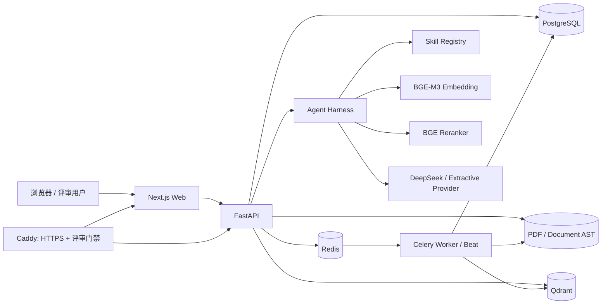
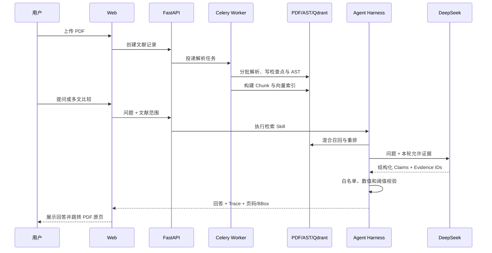

# PaperPilot：原文证据驱动的科研助手 Agent 系统

> 比赛技术文档初稿 · 2026-09-29  
> 目标成品：PDF，不超过 30 页  
> 建议成品页数：24–26 页  
> 当前状态：内容初稿；封面信息、正式截图、在线地址、最终 Tag 与提交 SHA 待提交前补齐

| 项目 | 待填写内容 |
| --- | --- |
| 参赛团队 | `[团队名称]` |
| 团队成员 | `[姓名 / 分工]` |
| 指导教师 | `[如适用]` |
| 代码仓库 | `https://github.com/Sana-114/PDF-AGENT` |
| 在线演示 | `[购置服务器并完成最终验收后填写]` |
| 最终版本 | `[Git Tag / Commit SHA]` |

## 摘要

PaperPilot 面向论文阅读、证据问答和研究材料整理，覆盖 PDF 管理与解析、单篇及多篇 RAG、版式感知阅读与翻译、论文检索推荐、局域引用图谱和学术写作可视化六类任务。系统不把大语言模型直接当作事实数据库，而是先将 PDF 解析为带页码、块编号和坐标的 Document AST，再经过混合检索、候选重排、证据门控和引用白名单生成回答。最终结论可回到 PDF 原页高亮；证据不足时返回拒答或抽取式结果。

系统采用 Next.js、FastAPI、Celery、PostgreSQL、Qdrant 与 Docker Compose 构建。标准模式使用 BGE-M3、BGE Reranker 与 DeepSeek Flash，轻量模式使用确定性 Hash-Ngram 与 BM25，便于低资源环境启动和故障演示。当前版本已经用真实 Transformer、BERT、GPT、ResNet 与 Vision Transformer 论文完成跨文献问答、数值事实、拒答和 PDF 锚点验收；同时完成 541 页长文档断点续跑和扫描替代样本 OCR 测试。组委会原始扫描件、公网服务器、域名及最终材料仍需在提交前完成复验和上线。

**关键词：** 科研 Agent；PDF 解析；检索增强生成；证据锚点；多文推理；引用图谱；学术翻译

---

## 1. 项目概述

### 1.1 背景与痛点

科研人员面对的困难不只是“读不完”，还包括以下四类断点：

1. PDF 的双栏、公式、表格、扫描页和超长篇幅难以统一结构化；
2. 通用对话模型会把记忆、推断和论文原文混在一起，答案难以追溯；
3. 阅读、翻译、问答、引用关系和写作工具分散，上下文需要重复搬运；
4. 新论文追踪与 Future Work 分析容易停留在关键词推荐，缺少局部证据和时间线。

PaperPilot 的设计原则是“先建立可定位证据，再让模型组织答案”。任何用于回答、比较、综述和写作的论文事实，均应尽可能保存文献、页码、Block ID、BBox 和原文摘录。

### 1.2 建设目标

- 对原生文本、扫描页和长文档建立统一 Document AST；
- 对相同论文的不同版本给出候选提醒、版本建议和可复核差异；
- 实现带原文页码与位置锚点的单篇问答和多篇对比；
- 打通 PDF 阅读、引用跳转、翻译和问答证据；
- 形成检索、追踪、推荐、图谱、综述和 Future Work 工作流；
- 让写作框架、References、图表与图注建立在可核验数据之上；
- 同时提供低资源演示模式和比赛标准模式，并保留公网部署门禁。

### 1.3 六大模块完成状态

| 模块 | 当前实现 | 状态与边界 |
| --- | --- | --- |
| PDF 管理与解析 | 单篇/批量上传、CRUD、内容指纹、版本冲突处理、Document AST、OCR、表格/图/公式候选、长文档检查点 | 主链路已实现；组委会原始扫描件待复验，复杂合并/旋转表格仍需专用适配器 |
| 抗幻觉问答 | BM25、Qdrant Dense/Sparse、BGE 重排、DeepSeek 生成、引用白名单、数值审计、拒答、多文比较 | 已用七篇真实论文完成固定金标验收；不宣称任意问题均正确 |
| 阅读与翻译 | PDF.js、三级目录、BBox 高亮、正文引用与 References 双向跳转、划词翻译、页级双语、同步滚动、整篇翻译、Markdown/HTML 导出 | 已实现；保持原位版式的双语 PDF 导出尚未实现 |
| 检索追踪推荐 | 题名/DOI/arXiv 检索、开放 PDF 安全导入、参考文献下钻、arXiv 定时刷新、代码链接、点赞/踩画像 | 已实现基础闭环；当前直接使用 arXiv API 与 Celery Beat，不依赖 Sickle |
| 引用图谱与综述 | 库内引用匹配、PageRank/入度、基石/桥接/衍生分类、证据综述、时间线与 Future Work | 已实现局域图谱；“已解决”只标记为可能有进展，保留人工确认 |
| 写作与可视化 | Abstract/Introduction/Related Work 框架、真实 References、Mermaid/Graphviz/TikZ/Matplotlib、CSV 折线/柱状/三维雷达图、Figure Caption、学术翻译审校 | 已实现；References 只使用本地持久化元数据，不接受模型凭空生成 |

---

## 2. 系统总体架构

### 2.1 分层架构



前端只负责交互和可视化，不在浏览器中保存模型密钥。FastAPI 提供文献、问答、推荐、图谱、写作和可视化接口；解析和整篇翻译由 Celery 异步执行；PostgreSQL 保存业务状态，文件卷保存 PDF、AST 与翻译缓存，Qdrant 保存向量索引。公网模式只开放 Caddy 的 80/443，其他服务留在 Docker 内部网络。

### 2.2 核心数据流



### 2.3 Agent Harness 与 Skills

Agent Harness 负责工具编排、证据门控、模型调用和结果校验。Skill Registry 为工具声明 Pydantic 输入 Schema，当前主要能力包括文献概要、目录、表格、图表、公式、参考文献和证据检索。工具返回结构化数据而非自由文本，使后续 Provider 的输入边界可审计。

这里的“Agent”不是无限自治的浏览器机器人，而是受业务流程约束的科研任务编排器：它只能调用已注册工具，只能引用本轮检索得到的证据编号，并把 Trace 返回给界面。

---

## 3. PDF 管理与细粒度解析

### 3.1 解析路由与 Document AST

解析前对均匀抽样页面诊断文本密度，将文件分为 `native_text`、`scanned_image`、`hybrid` 或 `empty`。原生文本使用 PyMuPDF 版式解析；低文本页选择性调用 Tesseract `chi_sim+eng`，避免整本文档重复 OCR。所有路径输出相同的 AST：

```text
Document
├── title / authors / affiliations / abstract
├── outline[]
├── pages[].blocks[]      # reading_order / page / bbox / block_id
├── tables[].cells[]      # 行列、Markdown、跨页 segments
├── figures[] / formulas[]
├── references[]
└── appendices[]
```

统一 AST 让阅读器、RAG、翻译、图谱和写作不需要分别解析 PDF。页码、BBox 和 Block ID 从解析阶段一直传递到最终回答。

### 3.2 双栏、表格、图表和公式

- 双栏页面根据几何位置和阅读顺序重排文本块；
- 有框表格分析矢量网格，无框表格要求可信图注和重复列锚点；
- 跨页表格仅在页面相邻、列边界一致且存在续表或重复表头时合并；
- 扫描页在图注附近执行受限栅格分析，避免把整页扫描图当作论文插图；
- 公式保存原文本与位置，并将明确的 Unicode 数学符号规范化为 LaTeX 候选。

公式字段是确定性候选，不冒充数学 OCR 真值。复杂二维分式、矩阵、旋转表格和合并单元格仍是后续适配方向。

### 3.3 长文档工程策略

Worker 默认每 25 页写入一个原子检查点，Manifest 绑定 PDF SHA-256、解析器版本、页数与批大小。任务中断后只重跑最后一个未完成批次；全部分片合并、数据库 Chunk 与索引提交完成后再清理检查点。前端读取 Manifest 展示完成页数，而不是等待整本结束。

真实 541 页教材验收中，系统在 50 页后模拟中断，恢复后的第一个完成事件为第 75 页；最终抽取 1,312,857 字，Python 峰值内存 45.11 MB、进程 RSS 峰值 298.58 MB。该结果证明工程规模和恢复能力，不等同于教材每个表格均被正确解析。

### 3.4 语义去重与版本演进

系统先使用文件 SHA-256 识别完全重复，再综合 arXiv ID、题名相似度和正文指纹重合度寻找版本候选。命中后只产生提醒，不自动删除：用户可以保留库中版本、以当前版本替换或两版并存。

版本差异从两个 AST 重建有序正文，输出页数、文本量、结构节点、标题集合和候选增删段落。差异段落保留来源页码与 Block ID，并标记为“可能新增/删除”，避免把词项差异包装为模型语义判断。

---

## 4. 抗幻觉 RAG 与多文推理

### 4.1 检索链路

```text
Question
  → BM25 精确召回
  → Qdrant Dense/Sparse RRF
  → 应用层融合
  → BGE Cross-Encoder 重排
  → Evidence score gate
  → DeepSeek Flash / Extractive Provider
  → 引用白名单与数值审计
  → Answer + Claims + Evidence + Trace
```

Chunk 不只包含普通正文，还包含摘要、表格、图注、公式和参考文献节点。问题含“表格分数”“完整引用”等意图时，检索器会提高对应节点类型的权重。BGE 或 Qdrant 故障时在线问答可以降级到 BM25，但严格验收要求 `retrieval_mode=reranked`，不会把降级结果误报为标准模式通过。

### 4.2 引用白名单

模型收到的证据被编号为本轮唯一的 `E1...En`。结构化输出中的每条 Claim 必须引用允许列表内的编号；未知编号、空引用或低分证据被拒绝。EvidenceAnchor 包含：

- `document_id`；
- `page_number`；
- `block_ids`；
- `bbox`；
- `section`；
- 原文摘录与检索阶段。

因此界面不仅能显示“来源”，还可以把用户带回 PDF 具体页面和区域。

### 4.3 多文比较与数值完整性

多文比较对每篇论文分别检索和重排，再合并为全局证据编号，避免长论文或 Chunk 较多的论文垄断候选池。对于问题中明确枚举的比较维度，系统追加逐维度检索。若用户明确要求参数量、上下文长度等数值，发布前检查回答是否覆盖已经入选且包含精确数值的证据；补充内容仍需通过同一引用与数值白名单。

没有双来源精确数值时，系统不会仅凭背景描述形成精确差异。例如论文没有报告 kg CO₂e 时，回答应说明证据不足，而不是估算排放数字。

### 4.4 连续问答

会话保存文献范围、用户消息、已验证回答、Claims、Evidence 与 Trace。SSE 先发送检索状态，再分片发送已经完成结构校验的答案，最后持久化消息。当前不是 DeepSeek 上游逐 Token 直传，而是“先校验、后渐进展示”，优先保证最终回答可恢复和可审计。

---

## 5. 版式感知阅读与翻译

PDF.js 阅读器按需加载页面并提供缩放、翻页和三级目录。问答证据的 PDF 点坐标被转换为百分比覆盖层，缩放后仍与原文对齐。无 BBox 时只执行页码定位，并明确提示没有区域高亮。

正文数字引用与 References 使用 AST 中的真实标签连接。用户从 `[11]` 跳到条目后，可以返回原点击位置，也可以浏览同一文献的上一处/下一处引用。未知标签不生成链接，从而降低公式编号被误识别为引用的风险。

翻译包含三条路径：

1. 划词/选段翻译：只翻译选区，保留公式、代码、引用和数字；
2. 页级双语：按 Block ID 对齐原文与译文，支持可关闭的双向同步滚动；
3. 整篇翻译：Celery 逐页执行，原子缓存和断点续跑，完成后导出 Markdown 或自包含 HTML。

当前不提供 DOCX，也尚未生成保持原始 PDF 版式的双语 PDF。比赛要求允许 Markdown/HTML 或原位 PDF，因此当前实现选择可审计、可恢复的 Markdown/HTML 路径。

---

## 6. 检索推荐、引用图谱与研究综述

### 6.1 论文发现与追踪

系统支持题名、DOI 和 arXiv ID 查询，数据来自 Semantic Scholar、Crossref 与 arXiv API。导入时后端重新查询来源，只允许白名单 HTTPS PDF 域名，并校验重定向、大小与 `%PDF-` 文件头，防止浏览器传入任意下载地址。

arXiv 追踪使用 Celery Beat 定期刷新关键词和分类订阅。推荐分综合本地文献相关度、时间新鲜度和 GitHub 代码加分；点赞加入正向画像，点踩形成负向惩罚。补充搜索到的 GitHub 仓库只标记为“高相关实现”，不冒充作者官方代码。

### 6.2 局域引用图谱

图谱只分析当前库内文献。边优先按 arXiv ID 精确匹配，再使用规范化题名和作者年份等可解释分数。每条边保留 References 原文、页码和匹配理由。PageRank 与入度组合为基石分，并按局部拓扑区分基石、桥接、衍生和孤立节点。

这里的“基石论文”仅代表用户导入语料形成的局部网络，不等同于全领域影响力排名。

### 6.3 Future Work

系统从摘要、引言、讨论、结论、限制和 Future Work 区域提取证据，并按论文时间线组织。只有较新论文与旧方向存在较高概念覆盖，且在可能时存在引用关系，才标记“可能已有进展”；界面同时展示旧方向和后续证据，最终状态由用户确认。

---

## 7. 学术写作与数据可视化

### 7.1 无幻觉写作框架

用户输入研究 idea 并选择本地文献后，系统检索证据并生成 Abstract、Introduction 与 Related Work 框架。最终 References 不采用模型输出的书目文本，而是从本地 Document 与 PaperSource 重建作者、题名、年份、Venue、DOI、arXiv ID 和链接；字段缺失时警告并留空。

### 7.2 架构图脚本

系统将用户描述的节点与连线规范化为同一中间图，再输出 Mermaid、Graphviz DOT、TikZ 和 Matplotlib 四种脚本。预览和源码同时保留，便于论文、README 或答辩材料复用。

### 7.3 CSV 可视化

CSV 分析器执行编码、分隔符、字段类型、缺失值和数值有效性检查，支持：

- 折线图与柱状图；
- 多次观测聚合和误差棒；
- 三维雷达图；
- SVG 页面预览；
- 可复现 Matplotlib 脚本；
- 只依据实际数据趋势生成的 Figure Caption。

单次观测不会伪造不确定性；雷达图的层高只区分记录，不解释为额外数值维度。

---

## 8. AI 技术选型与优化策略

| 技术 | 选型理由 | 集成方式 | 失败策略 |
| --- | --- | --- | --- |
| PyMuPDF | 本地、速度快、保留字体和坐标 | 统一 Parser 接口输出 AST | 页面诊断后对低文本页启用 OCR |
| Tesseract | 无外部 API、可复现 | `chi_sim+eng` 选择性 OCR | 保留原页、标记解析边界 |
| BGE-M3 | 中英文、多语义检索、1024 维 | TEI OpenAI-compatible Embedding | 查询降级 BM25，严格门禁判失败 |
| BGE Reranker v2 M3 | 对有限候选做跨编码器精排 | TEI/Cohere-compatible 接口，16 条微批 | 保留召回顺序并标记非 reranked |
| Qdrant | Dense/Sparse 命名向量和 Payload 过滤 | Collection 按模型签名与维度隔离 | 可关闭向量检索 |
| DeepSeek Flash | OpenAI-compatible、成本与延迟适合演示 | 独立 Responses Provider 适配器 | 抽取式 Provider，不编造缺失事实 |
| Structured Outputs | 限制自由文本不可审计问题 | Claims、Evidence IDs、翻译 Block ID | Schema/引用错误有限重试后降级 |

优化重点包括：

- PDF 分批检查点减少长任务重跑；
- 只对低文本页 OCR，避免扫描整本原生 PDF；
- 表格重型分析只进入有可信提示的页面；
- Embedding 批量请求，Reranker 微批避免超过 TEI 限制；
- 不同向量模型使用不同 Collection，避免维度污染；
- Next.js standalone 和非 root 生产镜像降低演示资源占用；
- Lite/Standard 双模式区分低资源体验与完整语义验收。

模型权重保存在 Docker 命名卷，API Key 只存在被 Git 忽略的环境文件，均不提交到公开仓库。

---

## 9. 测试与验证

### 9.1 核心结果

| 测试项 | 当前结果 | 证据 |
| --- | --- | --- |
| Transformer v7→v1 | 8/8 检查通过；综合重复分 0.82，建议保留 v7 | `release-core-gate-acceptance-2026-09-27.md` |
| 扫描替代样本 | 15/15 页 OCR；36,674 字、8 位作者、23 个目录节点 | 同上；明确不是官方原始扫描件 |
| 541 页教材 | 8/8 检查通过；断点续跑；1,312,857 字 | 同上 |
| 七篇论文向量索引 | 1,405 个文本块与 Qdrant Point 逐篇一致 | `real-pdf-browser-expanded-acceptance-2026-09-27.md` |
| BGE + DeepSeek 后端 | 连续三轮共 15/15 用例通过 | `numeric-fact-completeness-acceptance-2026-09-27.md` |
| 完整浏览器调用 | 两轮均 5/5；每轮 14/14 指定事实带页码锚点 | 同上 |
| 引用跳转与拒答 | PDF 高亮跳转通过；无精确 CO₂e 证据时拒答 | 同上 |
| 前端回归 | 15 项测试、类型检查和生产构建通过 | Stage 64、Stage 69 验收记录 |

### 9.2 评价原则

以上结果是固定论文、固定问题和固定金标的工程验收，不外推为开放域准确率。运行时完整回答与截图位于被忽略的 `backend/tmp/`，公开仓库保存可复现脚本、样本来源哈希和人工核对规则，不保存 API Key、模型权重或受限 PDF。

### 9.3 提交前仍需完成

- 获取组委会 `pdf/` 原始目录并校验哈希；
- 复验官方 `1706.03762v1_img.pdf` 的机构、表格、图表和 OCR；
- 对官方 541 页教材做真实目录和表格质量抽检；
- 在最终公网环境完成上传、解析、问答、跳转和拒答闭环；
- 记录最终 Tag、SHA、演示地址、硬件和运行模式。

---

## 10. 部署、安全与可复现性

### 10.1 本地与标准模式

Windows 本地可使用：

```powershell
.\scripts\start.ps1 -Mode lite
.\scripts\start.ps1 -Mode standard -Gpu
```

Lite 模式不启动 BGE，适合首次体验；Standard 模式启动 BGE-M3 与 Reranker，用于完整 RAG 演示。停止服务默认保留数据库、PDF、索引和模型缓存。

### 10.2 公网部署策略

现有公网配置继续保留，暂不购买服务器。临近提交时再完成：

1. 购买 Ubuntu 服务器并准备域名；
2. DNS 指向公网 IP，安全组只开放 80/443 和受限 SSH；
3. 在服务器本地填写 `.env.production` 与 `.env.bge`；
4. 使用全新的 DeepSeek Key、随机数据库/MinIO 密码和评审密码哈希；
5. 执行 `./scripts/deploy.sh standard-gpu start` 或适合硬件的模式；
6. 从另一网络运行 `scripts/verify_public_demo.sh`；
7. 手工完成核心业务闭环并做重启恢复演练。

生产 Compose 只由 Caddy 发布端口，自动 HTTPS、Basic Auth、安全响应头、日志滚动和数据卷均已配置。Basic Auth 是比赛入口门禁，不等同于应用级多用户隔离。

### 10.3 敏感信息

- `.env`、`.env.production`、`.env.bge` 均不提交；
- 聊天、日志或截图中出现过的 Key 必须撤销并轮换；
- 视频隐藏服务器 IP、内部日志、个人账号和密钥；
- 最终提交前扫描 Git 历史并从全新目录克隆启动。

---

## 11. 创新点

### 11.1 技术创新

1. **贯穿全链路的证据坐标。** AST、Chunk、Claim 和阅读器共用页码、Block ID 与 BBox，回答可回到原页而不是只给文献名。
2. **检索降级与验收门禁分离。** 线上故障时允许 BM25 保持可用，但严格测试要求真实 reranked 证据，避免“静默降级仍显示成功”。
3. **多文献公平取证。** 每篇论文独立召回、重排和预算分配，再形成全局证据，降低候选池被单篇文献垄断的问题。
4. **生成后事实完整性复核。** 不只检查有没有引用，还检查用户明确要求且原文已经检出的数值是否进入最终声明。
5. **长文档原子检查点。** 页面分片、Manifest 签名和原子替换支持 541 页任务中断恢复，并控制内存占用。
6. **模型文本与真实 References 解耦。** 写作框架的书目由持久化元数据重建，模型无法凭空写入最终 References。

### 11.2 应用创新

1. 问答证据、PDF 阅读、引用导航与翻译处于同一工作区；
2. 版本冲突不自动覆盖，允许用户查看差异后决定；
3. Future Work 同时展示旧方向与后续证据，把“是否已解决”留给研究者确认；
4. 图表 Caption、架构图源码和论文框架均输出可编辑、可复现材料，而不是不可追溯图片。

---

## 12. 已知边界与后续计划

- 组委会原始扫描 PDF 尚未取得，现有 OCR 成绩来自可复现替代样本；
- 复杂公式仍是 LaTeX 候选，未接入专用数学 OCR；
- 复杂合并单元格、旋转表格和弱信号跨页表格需要专用适配器；
- 双语导出当前为 Markdown/HTML，原位排版 PDF 尚未完成；
- 公网模式当前是共享评审门禁，不具备多租户文献所有权；
- 生成模型存在随机性，固定金标通过不能等同任意问题准确；
- 真实服务器、域名和最终外网验收将临近提交时完成，以减少空置费用。

后续优先级：官方样本复验 → 公网部署与外部验收 → 技术 PDF 排版 → 视频录制 → 最终 Tag 与材料哈希冻结。

---

## 13. 成品 PDF 编排建议

| 页码预算 | 内容 |
| --- | --- |
| 1 | 封面 |
| 2 | 摘要与关键词 |
| 3 | 目录 |
| 4–5 | 项目概述、需求分析、六模块映射 |
| 6–8 | 总体架构、数据流、Agent Harness |
| 9–12 | PDF 解析、OCR、长文档与去重 |
| 13–16 | RAG、多文推理、引用白名单与阅读器 |
| 17–19 | 推荐、图谱、综述、写作与可视化 |
| 20–21 | AI 选型、优化与失败降级 |
| 22–23 | 测试结果与复现方式 |
| 24 | 部署与安全 |
| 25 | 创新点、边界和展望 |
| 26 | 最终链接、版本信息与参考资料 |

最终排版时优先放置以下截图：版本去重提示、Document AST/目录、带证据回答、PDF 原页高亮、多文比较矩阵、双语联动、引用图谱、写作框架、三维雷达图和公网门禁。每张截图必须带简短结论，避免只展示界面。

## 14. 仓库内参考资料

- 总体架构：`docs/architecture.md`
- 核心交付门禁：`docs/release-core-gate-acceptance-2026-09-27.md`
- 数值事实完整性：`docs/numeric-fact-completeness-acceptance-2026-09-27.md`
- 真实 PDF 浏览器闭环：`docs/real-pdf-browser-expanded-acceptance-2026-09-27.md`
- 扫描 PDF OCR：`docs/scanned-pdf-ocr-acceptance-2026-09-13.md`
- 541 页长文档：`docs/long-document-acceptance-2026-09-14.md`
- 公网部署：`docs/public-deployment.md`
- 比赛交付清单：`docs/competition-delivery-checklist.md`

